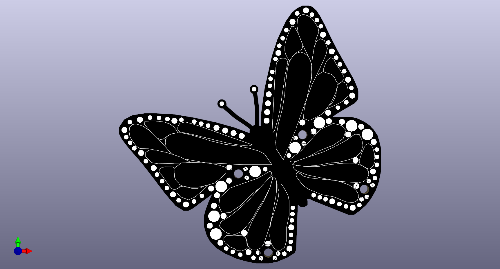
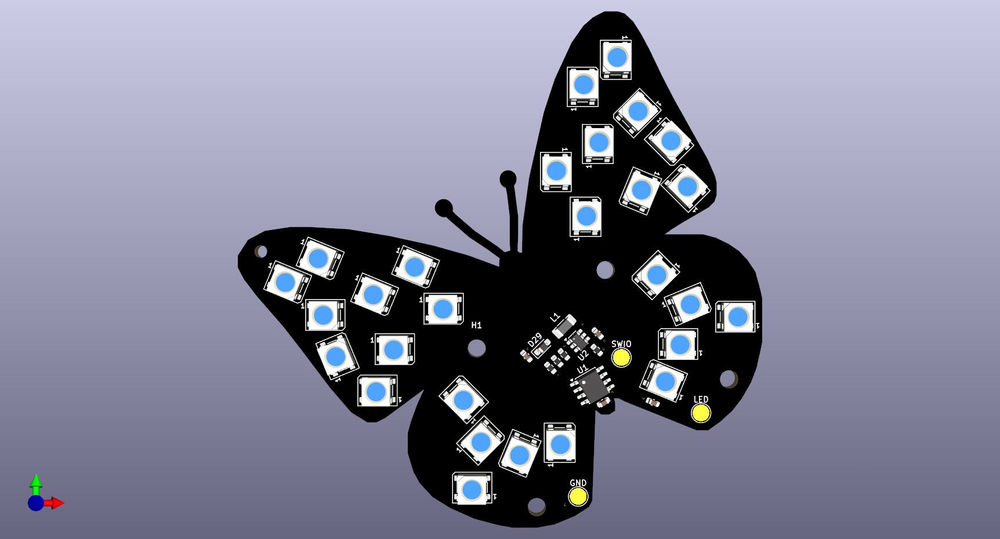
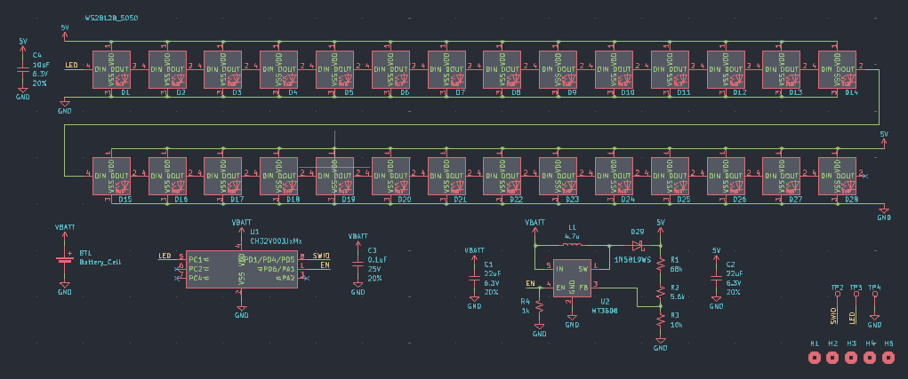

# ButterflyLight
Butterfly-shaped keychain thing with addressable leds

### Front PCB with decorative silkscreen and solder mask cutouts

### Back PCB with components and battery holder

### Schematic for back PCB

## Design Choices 
* CH32V003 in SOIC 8 package-low cost, great SDk courtesy of cnLohr: [ch32fun](https://github.com/cnlohr/ch32fun)
* CR2032 battery holder on back
* Switching regulator to convert battery voltage to suitable 5V for leds
